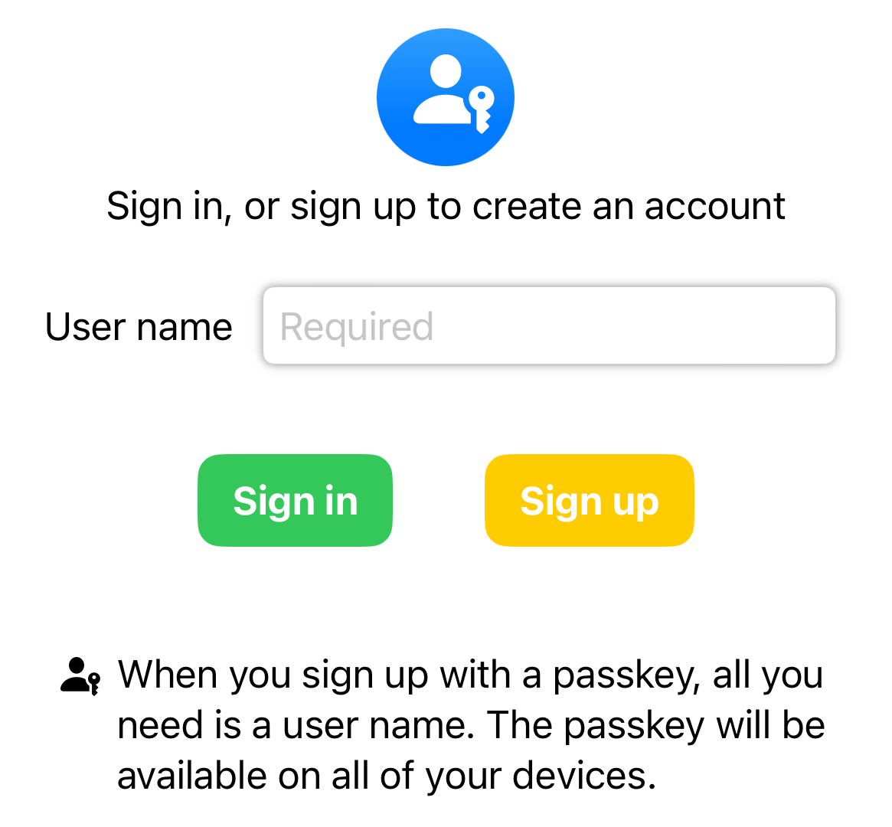
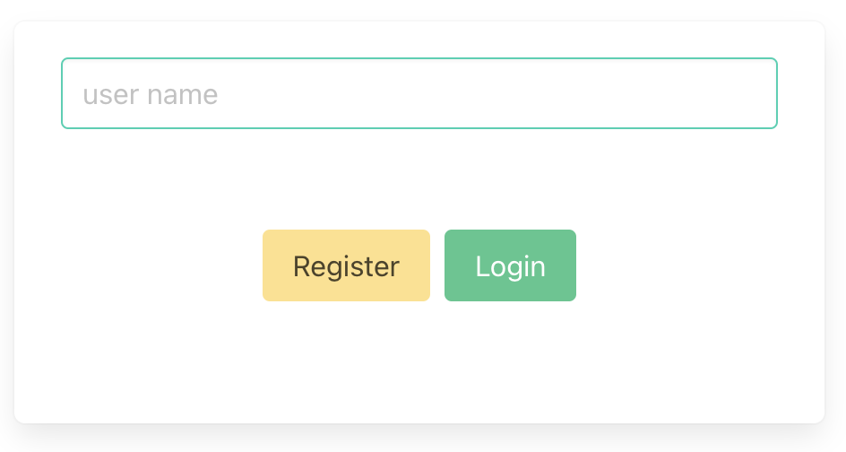

# crux-passkey

  
  

# Passkeys

Passkeys are awesome! Just a public/private key pair that you can use to
authenticate with a website (or an associated app).

They are _much_ more convenient that passwords because you don't have to
remember anything. And they are _more_ secure because they're tied to the site
you're authenticating with so phishing is eliminated, and only a public key is
stored on the server so there is nothing worth stealing (the public key is, you
guessed it, public).

The private key is kept by you. Or rather, your password manager, so it can be
shared between devices.
[Apple](https://support.apple.com/en-gb/guide/iphone/iphf538ea8d0/ios),
[Google](https://blog.google/technology/safety-security/the-beginning-of-the-end-of-the-password/),
[Microsoft](https://support.microsoft.com/en-us/windows/passkeys-in-windows-301c8944-5ea2-452b-9886-97e4d2ef4422)
and
[Amazon](https://www.aboutamazon.com/news/retail/amazon-passwordless-sign-in-passkey)
are actively encouraging uptake. If you store a passkey in a password manager
(such as [Dashlane](https://www.dashlane.com/passkeys),
[1Password](https://1password.com/product/passkeys) or
[Apple Keychain](https://support.apple.com/en-gb/guide/iphone/iph82d6721b2/17.0/ios/17.0))
you can also share it with friends.

Registering with, and logging into, websites and apps has, until now, been a
huge barrier, but with passkeys it is finally solved. I want to see them
everywhere! Let's finally consign passwords to the bin — passkeys are easier and
more secure, what's not to like?

# Crux

At [Red Badger](https://red-badger.com/), we maintain an
[open source](https://github.com/redbadger/crux) multi-platform app development
toolkit called [Crux](https://red-badger.com/crux). It uses
[Rust](https://www.rust-lang.org/) and [WebAssembly](https://webassembly.org/)
to make it easy and fun to build a single app that runs on iOS, Android and Web
(and command line, and terminal apps, and...).

Crux allows us to build the _functionality_ of our app once, and test it in
milliseconds, allowing us to ensure our app works correctly and exactly the same
on all platforms.

So I wanted to bring passkeys to Crux apps.

It's not massively complicated to do this, but there are a few steps for both
registration and login that you need to get right. It's a bit tricky to add it
to existing web applications (and iOS apps and Android apps) and make sure that
the implementation is correct on all three. Crux helps here. We can just build
and test it once.

# Fermyon Spin

My plan was great — bringing together really cool tech like passkeys, Rust,
WebAssembly, and Crux — but I wanted more.

So I added [Fermyon Spin](https://www.fermyon.com/spin) into the equation. Spin
is great! It's Serverless without the cold start. Ultra lightweight services
that are started in response to an incoming request (in microseconds) and die
after the request has been processed.

To support passkeys, we need a service backend that exposes the
[WebAuthn](https://en.wikipedia.org/wiki/WebAuthn) protocol. I had to jump
through a few hoops. And of course we're on the bleeding edge here — when you're
down a rabbit hole, you have to climb back out of it yourself.

The server-side component is written in Rust, compiled to WebAssembly (Wasm),
and can be deployed, as is, to [Fermyon Cloud](https://www.fermyon.com/cloud).
